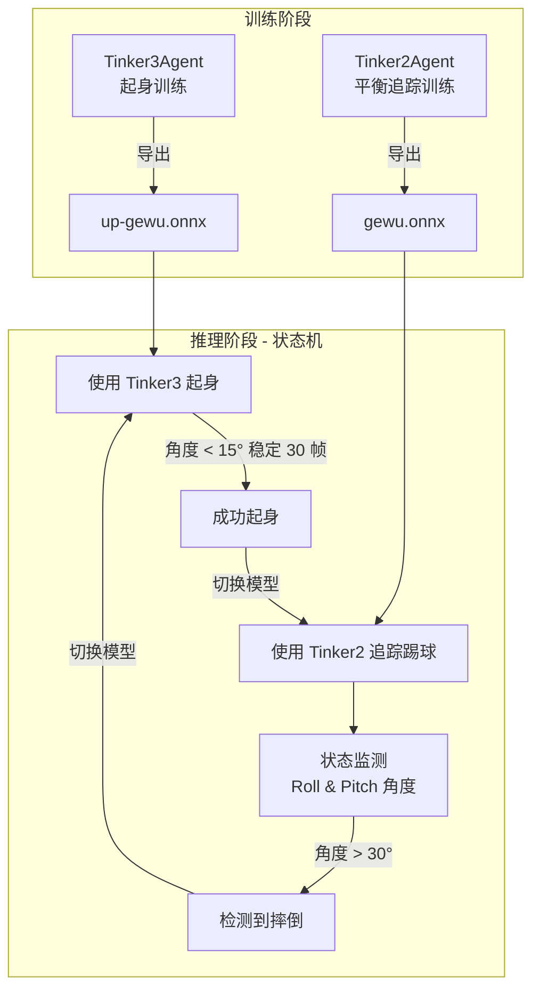

# 越位研究所 — 赛博少林足球

> 基于 Unity ML-Agents 的仿人机器人自主足球智能体，实现平衡行走、追踪踢球、摔倒自动起身的全流程自主行为。

---

## 📌 项目简介

本项目是参加 **"格物"具身智能仿真平台** 足球比赛的完整解决方案，旨在训练仿人机器人在虚拟足球场上实现 **自主平衡、追踪踢球、自动起身** 的全流程自主行为。

核心特性：
- 🏃 **课程学习 (Curriculum Learning)**：从静态平衡到高速对抗，循序渐进的训练策略
- 🔄 **双模型状态机架构**：Tinker2（平衡追踪）与 Tinker3（起身恢复）的动态无缝切换
- ⚽ **运动学踢球**：RL 控制平衡 + 运动学控制踢球动作的混合方法
- 🛡️ **鲁棒性训练**：多姿态初始化、外部干扰、随机移动模式覆盖真实比赛场景

### 🎬 效果展示

<table>
  <tr>
    <td align="center"><b>起身训练效果</b></td>
    <td align="center"><b>完整比赛效果</b></td>
  </tr>
  <tr>
    <td>
      <video src="./videos/standup-all-bgm.mp4" controls width="380">
        您的浏览器不支持视频标签
      </video>
    </td>
    <td>
      <video src="./videos/final.mp4" controls width="380">
        您的浏览器不支持视频标签
      </video>
    </td>
  </tr>
</table>

---

## 🏗️ 系统架构



---

## 📂 项目结构

```
football-match-gewu-2025/
├── images/                      # 图片资源
│   ├── up.png                   #   起身训练截图
│   └── reward.png               #   奖励函数曲线
├── videos/                      # 视频资源
│   ├── standup-all-bgm.mp4      #   起身训练效果视频
│   └── final.mp4                #   完整比赛效果视频
├── models/                      # 训练好的 ONNX 模型
│   ├── gewu.onnx                #   Tinker2 平衡与追踪模型
│   └── up-gewu.onnx             #   Tinker3 起身模型
├── Tinker2Agent.cs              # 核心智能体：平衡、移动、踢球、模型切换
├── Tinker3Agent.cs              # 起身智能体：从各种倒地姿态恢复站立
├── config-balance.yaml          # Tinker2 平衡训练配置（8 阶段课程学习）
├── config-up.yaml               # Tinker3 起身训练配置（32 阶段课程学习）
├── 越位研究所-赛博少林足球 技术报告.pdf  # 技术报告
├── 成员名单.md                   # 团队成员
└── README.md                    # 本文档
```

---

## 🎓 技术方案详解

### 1. 起身训练 (Tinker3Agent)

训练机器人从 **任意倒地姿态** 恢复到站立状态。

#### 多姿态初始化

为增强鲁棒性，训练时随机初始化机器人的倒地姿态：

| 姿态 | 描述 | 初始化角度 |
|------|------|-----------|
| 平躺 (Supine) | 背部着地 | Z 轴 -90° |
| 趴着 (Prone) | 面部朝地 | Z 轴 90° |
| 侧躺 (Side) | 左/右侧着地 | Z 轴 0° / 180° |
| 随机 (Random) | 完全随机角度 | 随机 |

训练中循环切换这四种姿态，防止模型对单一姿态过拟合。

#### 辅助提拉力课程

通过课程学习逐步降低辅助提拉力 `lift_force`（70 → 0），迫使机器人从依赖辅助力到完全自主起身，共 **32 个课程阶段**。

#### 奖励函数

核心奖励为机器人躯干向上方向与世界垂直轴的点积 (`UpDotVertical`)，完全直立时获得最大奖励。同时加入姿态惩罚和侧向速度惩罚，增强高速运动下的稳定性。

<p align="center">
  
</p>

### 2. 平衡追踪训练 (Tinker2Agent)

采用 **8 阶段课程学习**，从静止平衡到复杂对抗逐步递进。

| 阶段 | 描述 | 速度范围 | 踢球概率 | 外部干扰 |
|:---:|------|---------|:-------:|:-------:|
| 0 | 静态平衡 | 0 (静止) | 0% | ❌ |
| 1 | 基础动态平衡 | 0.3 – 0.6 | 0% | ❌ |
| 2 | 动态平衡 (低) | 0.5 – 0.8 | 0% | ❌ |
| 3 | 动态平衡 (中) | 0.7 – 1.0 | 0% | ❌ |
| 4 | 动态平衡 (高) | 0.9 – 1.3 | 0% | ❌ |
| 5 | 高速 + 踢球 | 1.2 – 1.6 | 30% | ❌ |
| 6 | 超高速 + 踢球 | 1.5 – 2.0 | 50% | ❌ |
| 7 | 超高速 + 踢球 + 干扰 | 1.5 – 2.0 | 50% | ✅ 1.0f–3.0f |

**9 种随机移动模式** 覆盖球场主要步态：纯前进、原地转弯、快速转向、前进+转弯、前进+急转、后退+转弯、侧向移动、慢速靠近+急转、交替转向。

**外部干扰**（Lesson 7）：每隔 80–150 帧随机施加水平脉冲推力（70% 触发概率），模拟比赛中的碰撞。

### 3. 追踪与踢球

- **球体追踪**：实时计算与球的相对角度和距离，动态调整角速度；近距离时加快转向、降低线速度以精确对准
- **运动学踢球**：基于运动学曲线控制髋关节（先外展后内旋）与膝关节（先屈曲蓄力后快速伸展）的协同运动
- **射门逻辑**：控球 (< 0.5m) 且球在正前方时，自动计算球门方向调整姿态完成射门

> 💡 **设计理念**：RL 控制平衡 + 运动学控制动作的混合方法，兼顾踢球的稳定性和力度。

### 4. 双模型融合（状态机）

项目的核心创新——在推理阶段通过 **状态机** 动态切换两个独立训练的模型：

```
正常状态 ──[Roll/Pitch > 30°]──▶ 摔倒
    ▲                              │
    │                    切换到 Tinker3（起身模型）
    │                              │
    │                              ▼
    └──[稳定 30 帧]──── 起身中（角度 < 15°）
       切换回 Tinker2（追踪模型）
```

关键参数：
- `fallAngleThreshold`：摔倒检测角度阈值（默认 **30°**）
- `standUpAngleThreshold`：起身成功角度阈值（默认 **15°**）
- `standUpStableFrames`：需保持稳定的帧数（默认 **30 帧**）

---

## 🚀 复现指南

### 环境要求

| 依赖 | 最低版本 |
|------|---------|
| Unity | 2021.3+ |
| ML-Agents | 2.0.0+ |
| Python | 3.8+ |
| PyTorch | 1.8.0+ |

> 详细环境搭建请参考：[**"格物"具身智能仿真平台**](https://github.com/loongOpen/Unity-RL-Playground?tab=readme-ov-file#%E4%BA%8C%E8%AE%AD%E7%BB%83%E7%8E%AF%E5%A2%83%E5%AE%89%E8%A3%85)

### 训练流程

> [!IMPORTANT]
> **ObservationNum 必须设置为 33**，这是两个智能体的关键配置。

#### Step 1：训练起身模型 (Tinker3)

```bash
mlagents-learn config-up.yaml --run-id=tinker3-standup
```

1. 将 `Tinker3Agent.cs` 附加到机器人 GameObject
2. Inspector 中设置 `train = true`，`ObservationNum = 33`
3. 启动训练，模型将保存在 `results/tinker3-standup/`
4. 导出 `.onnx` 模型到 `models/` 目录

#### Step 2：训练平衡追踪模型 (Tinker2)

```bash
mlagents-learn config-balance.yaml --run-id=tinker2-balance
```

1. 将 `Tinker2Agent.cs` 附加到机器人 GameObject
2. Inspector 中设置 `train = true`，`ObservationNum = 33`
3. 将球体 Transform 分配给 `ball` 字段
4. 启动训练，模型将保存在 `results/tinker2-balance/`
5. 导出 `.onnx` 模型到 `models/` 目录

#### Step 3：集成测试

1. 将 `Tinker2Agent.cs` 附加到机器人，设置 `train = false`
2. 在 Inspector 中配置：
   - `tinker2Model` → `gewu.onnx`
   - `tinker3Model` → `up-gewu.onnx`
   - `ball` → 场景中的球体 Transform
   - `goal` → 球门 Transform（可选）
3. 运行场景，机器人将自动执行追踪踢球 + 摔倒起身的完整流程

**调试快捷键**：
| 按键 | 功能 |
|:---:|------|
| `Space` | 重置球的位置 |
| `R` | 重置机器人并结束当前 Episode |

### 预训练模型

项目提供了训练好的模型文件，位于 `models/` 目录：

| 模型文件 | 用途 |
|---------|------|
| `gewu.onnx` | Tinker2 平衡与追踪模型 |
| `up-gewu.onnx` | Tinker3 起身模型 |

---

## ⚠️ 注意事项

1. **训练顺序**：建议先训练 Tinker3（起身），再训练 Tinker2（平衡），两者可独立训练
2. **模型切换**：仅在 `train = false` 时生效，训练模式下不会自动切换模型
3. **性能优化**：训练时可设置 `accelerate = true`（20 倍时间缩放），测试时建议关闭
4. **课程监控**：可通过 TensorBoard 监控训练进度和课程阶段切换

---

## 🔮 未来工作

- **强化学习踢球**：将踢球纳入 RL 动作空间，动态调整踢球力度和角度
- **多智能体协作**：引入 MA-PPO 算法，训练多机器人传球、跑位、掩护等战术
- **Sim-to-Real 迁移**：增加域随机化（摩擦力、质量、电机扭矩），优化控制频率和延迟处理

---

<p align="center">
  
</p>

<p align="center"><i>Tinker3 起身训练效果展示</i></p>